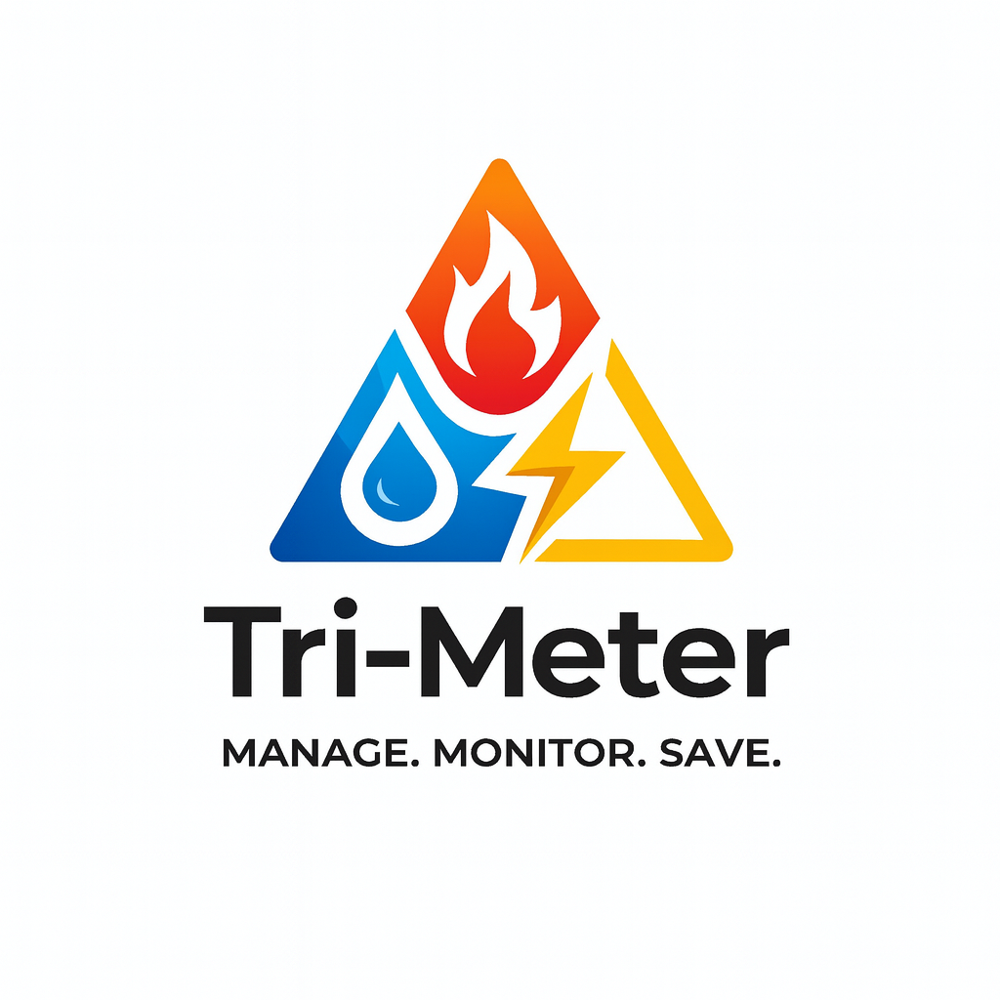

# 🌟 Tri-Meter - Utility Management System (UMS)

**PUSL2019 - Information Management and Retrieval Coursework**                  

<div>
  
</div>

## 🗒️ Overview

Full-stack web application for managing utility services (⚡ Electricity, 💧 Water, 💨 Gas) including customer management, meter readings, billing, payments, and reporting.


## 📌 Features 
- User role management (Admin, Manager, Cashier, Customer)
- Login & session-based authentication 🔐
- CRUD operations for users & meters 📝
- File upload for documents and images 📁
- Responsive UI using Tailwind CSS 📱


## 📁 Folder Structure

```
tri-meter/
├── docs/                  # All project documentation
│   ├── 1-requirements/
│   ├── 2-database-design/
│   ├── 3-implementation/
│   ├── 4-critical-evaluation/
│   └── 5-individual-contributions/
├── database/              # All SQL scripts
│   ├── schemas/
│   ├── user-defined-functions/
│   ├── stored-procedures/
│   ├── triggers/
│   └── views/
├── backend/               # Node.js API
├── frontend/              # React UI
├── design/                # Figma exports
└── presentation/          # Presentation recording resources
```

## 🏁 Quick Start

### Prerequisites
- Node.js 20+ and npm
- MS SQL Server Management Studio (SSMS) / Azure Data Studio
- Git
- VS Code (recommended)

### Setup Instructions
1. Clone the repository
2. Follow `SETUP-GUIDE.md` for detailed environment setup
3. Configure Azure SQL Database connection
4. Install dependencies for backend and frontend
5. Run development servers

See `SETUP-GUIDE.md` for complete instructions.

## ⚜️ Milestones

**Phase 0 :** Setup & Planning        
**Phase 1 :** Database Design       
**Phase 2 :** Database Implementation      
**Phase 3 :** Backend API         
**Phase 4 :** Frontend Development       
**Phase 5 :** Testing & Documentation       
**Phase 6 :** Report, Presentation & Submission

## 🤼 The Team

**Lead:** [@dwainXDL](https://github.com/dwainXDL)      
**Frontend Lead:** [@PWTMihisara](https://github.com/PWTMihisara)      
**Documentation & UI Lead:** [@drnykteresteinwayne](https://github.com/drnykteresteinwayne)         
**UI Dev:** [@thiranya123](https://github.com/thiranya123)       
**Art Dev:** [@kmss-sew](https://github.com/kmss-sew)

## 📫 Contact

If you have any feedback or questions, feel free to contact me.
